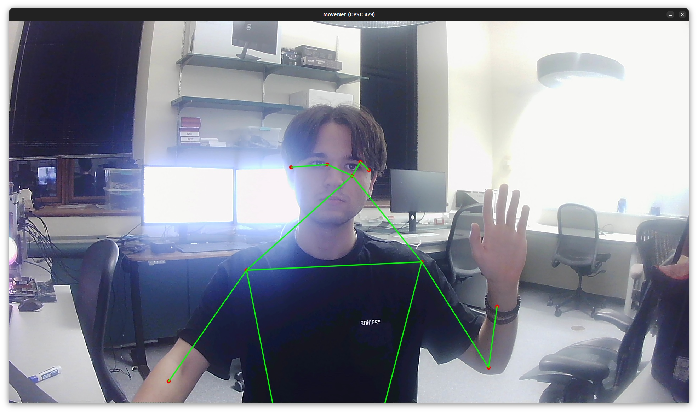

# Reducing Latency

### Overview

This work involves optimizing the flow of video capture and DNN (Deep Neural Network) inference in a resource-constrained environment. The system is split into two components running over a TCP connection: the local client component captures images from the camera, sends them to a remote server for inference, and displays the results; the remote server component performs the DNN inference using TensorFlow Lite, processes the images, and sends back the results.

The key goals of this project are to:
1. Offload DNN inference to a more powerful remote server.
2. Minimize memory access overheads by reducing the number of kernel-user boundary crossings.
3. Optimize the system for performance, ensuring the client can handle high frame rates.

### General Structure

The system consists of a **client** and a **server**. The client captures video frames using the Video for Linux (V4L2) API and sends them to the server. The server processes the frames using TensorFlow Lite and returns inference results to the client. Communication between the two is handled asynchronously over TCP.

- The **client** is structured with two main components:
  - `App` struct: Handles the camera capture and marks inference results on the display.
  - `Server-facing` struct: Manages the TCP connection to the server, serializes images, and retrieves inference results.
  
- The **server** listens for incoming image data, performs inference, and sends the results back to the client.

The architecture separates the app logic from network handling, ensuring modularity and ease of future updates.

```
anton@anton22:~/workspace/rust_movenet_client/src$ tree
.
├── app.rs
├── buffer.rs
├── camera.rs
├── ioctl_macros.rs
├── main.rs
└── server_facing.rs
```

```
anton@anton22:~/workspace/rust_movenet_server/src$ tree
.
├── main.rs
└── utils.rs
```

Run the client and server components using `cargo run`, ensuring you configure the appropriate IP address for server communication.

### Valuable Resources Used

- [Nix Documentation](https://docs.rs/nix/latest/nix/sys/ioctl/index.html)
- [OpenCV Video Capture Code](https://github.com/opencv/opencv/blob/67fa8a2f4720404a15da7a723bc048b247c5d227/modules/videoio/src/cap_v4l.cpp)
- [Kernel Documentation on Memory Mapping](https://www.kernel.org/doc/html/v4.9/media/uapi/v4l/mmap.html)
- [Kernel Documentation on Video Capture](https://www.kernel.org/doc/html/v4.9/media/uapi/v4l/capture.c.html)

### Results

```
anton@anton22:~/workspace/rust_movenet_client/src$ cargo run
   Compiling rust_movenet_client v0.1.0 (/home/anton/workspace/rust_movenet_client)
    Finished `dev` profile [unoptimized + debuginfo] target(s) in 1.68s
     Running `/home/anton/workspace/rust_movenet_client/target/debug/rust_movenet_client`
Camera device fd: 4
Streaming started!
FPS: 30.40
FPS: 30.67
```


